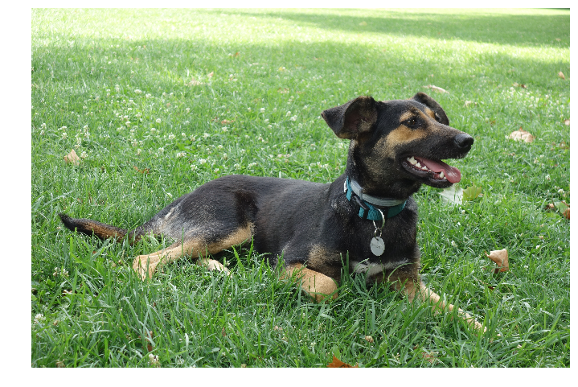

These instructions will help resolve dependencies and implement DL packages with ROS and Ubuntu.

#### Instructions:

ROS Kinetic runs with Python 2.7, so no matter what, you should ensure that the system default Python is 2.7. 

##### Dependencies:

<u>Note:</u> Use pip to install all the packages. Pip should already be installed, but if it is not, installation instructions can be found [here.](https://pip.pypa.io/en/stable/installing/) If you get a syntax error while using pip upgrade with

```bash
$ pip install -U pip
```

* Install Tensorflow version 1.15 (requires CUDA 10.0)

  ```bash
  $ pip install --user --upgrade tensorflow-gpu==1.15
  ```

  If not training and facing troubles with CUDA installation, then install the CPU only version. 

  ```bash
  $ pip install --user --upgrade tensorflow==1.14
  ```

* Install Keras:

  Install Keras version 2.3.1

  ```bash
  $ pip install keras==2.3.1
  ```

* Install h5py. You will need this to load the models.

  ```bash
  $ pip install h5py
  ```


* Numpy: 

  ```bash
  $ pip install numpy
  ```


* Install the ROS USB cam node to view camera data from the laptop webcam or any connected usb camera

  ```bash
  $ sudo apt-get install ros-<distro>-usb-cam
  ```

  

To test if everything is working, open Python in your terminal and import all the necessary modules. 

```python
import cv2
import rospy
import numpy as np
from std_msgs.msg import String
from sensor_msgs.msg import Image
from cv_bridge import CvBridge, CvBridgeError
import tensorflow 
import keras
```

If there are no errors, you should be able to continue. Resolving any issues and dependencies may take time. 

**Deep Learning and ROS**

In the  `bootcamp-assignments` folder there is a package called `object_recognition`. Within it there is an empty `models` folder. Download the pre-trained YOLOv3 and TinyYOLOv3 models from the drive link into this folder (https://drive.google.com/drive/folders/1ni9L2r2xKmSfoaX6T8I2Biy53taakAn-?usp=sharing). 


To keep GitHub from trying to upload this folder when (and if) you push changes to this repo in the future, place it within a ".gitignore" file. The model files are too big to be uploaded onto Github.

*Brief Segue:*  **Git Ignore:**

- Create a file called `.gitignore` in your folder
- Open the file and type the name of the folder you want it to ignore. In this case that folder will be called `models`.
- Now when you push changes, GitHub will ignore this folder.


The `classify_tinyyolov3_lite.py` has the following publishers and subscribers:

**Subscribers**: 

* `[topic]/image_raw`: Image data from camera node. Currently extracting data from the USB camera node. Requires the [usb_cam](http://wiki.ros.org/usb_cam) node to be running.

**Publishers**:

* `object_detector`: Publishes label and prediction of the class with maximum score and coordinates of the bounding box, under the message type `Predictor.msg`

The package has a custom message type `Predictor` that accepts the predicted label and the confidence score that is published by `object_detector`. 

Run the code and see if you can get it to predict different objects. You will use TinyYOLO to recognize a stop sign later in the course. 

<u>Note:</u> The `usb_cam` [ROS package](http://wiki.ros.org/usb_cam) can be used to publish image data from your laptop's inbuilt camera. 


There are different aspects of this code you should pay attention to. 

<u>To load the model</u>: 

```python
GPU_OPTIONS = tf.GPUOptions(allow_growth=True)
CONFIG = tf.ConfigProto(gpu_options=GPU_OPTIONS)
CONFIG.gpu_options.per_process_gpu_memory_fraction = 0.5

model = load_model('models/tinyyolo.h5')
model._make_predict_function()
graph = tf.compat.v1.get_default_graph()
```

The GPU options are only necessary to set if your computer is using the GPU to run tensorflow. To avoid running out of memory, `CONFIG.gpu_options.per_process_gpu_memory_fraction = 0.5` should be used to set it to an appropriate fraction.


<u>Define publishers and subscribers:</u>

```python
rospy.init_node('classify', anonymous=True)

rospy.Subscriber("usb_cam/image_raw", Image, callback, queue_size = 1, buff_size = 16777216)

pub = rospy.Publisher('object_detector', Predictor, queue_size = 1)
```


<u>The prediction occurs within the callback:</u>

* Convert ROS Image to OpenCV and then to numpy

  ```python
  cv_image = bridge.imgmsg_to_cv2(image_msg, desired_encoding="passthrough")
  height, width, channels = cv_image.shape
  cv_image_target = cv2.resize(cv_image, target_size) 
  np_image = img_to_array(cv_image_target) #convert to numpy
  ```

* Calling the Keras session defines earlier

  ```bash
  with graph.as_default():
  	tf.keras.backend.set_session(sess)
  ```

* Predict the image

  ```python
  yhat = model.predict(np_image)
  ```

* Interpret the prediction. To do this the code employs some custom functions necessary to interpret the TinyYOLO prediction. 

  ```python
  for i in range(len(yhat)):
      # decode the output of the network
      preds += decode_netout(yhat[i][0], anchors[i], class_threshold, target_size)
  
  # get the details of the detected objects
  v_boxes, v_labels, v_scores = get_boxes(preds, labels, class_threshold)
  
  # summarize what we found
  for i in range(len(v_labels)):
  print(v_labels[i], v_scores[i])
  ```

* Finally, publish the predictions

  ```python
  # Publish only the max values
  try:
      max_pred_score = max(v_scores)
      max_pred_index = v_scores.index(max_pred_score)
      max_pred_label = v_labels[max_pred_index]
  
      pub_msg.header.stamp = rospy.Time.now()
      pub_msg.label = max_pred_label
      pub_msg.score = float(max_pred_score)
      pub_msg.box_coords = []
      pub.publish(pub_msg)
  
  except ValueError:
      print("Prediction below threshold")
      pass
  ```

This package uses a custom object detector, TinyYOLOv3, and therefore it is necessary to create custom functions to interpret the predictions. However, Keras does provide some inbuilt functions to interpret more commonly available object detectors. Th example below uses ResNet50:

```python
#!/usr/bin/env python

import numpy as np
import cv2
import tensorflow as tf
from keras.preprocessing import image
from keras.applications.resnet50 import ResNet50, preprocess_input, decode_predictions

model = ResNet50(weights='imagenet')
model._make_predict_function()
graph = tf.get_default_graph()
target_size = (224, 224)


cv_image = cv2.imread("dog.png",cv2.IMREAD_COLOR)
cv_image = cv2.resize(cv_image, target_size)  # resize image
np_image = np.asarray(cv_image)               # read as np array
np_image = np.expand_dims(np_image, axis=0)   # Add another dimension for tensorflow
np_image = np_image.astype(float)  # preprocess needs float64 and img is uint8
np_image = preprocess_input(np_image)         # Regularize the data
    
with graph.as_default():
    preds = model.predict(np_image)            # Classify the image
    pred_string = decode_predictions(preds, top=1)   # Decode top 1 predictions
    print(pred_string)
```



The first time you implement it, the model will take some time to download. 

Can you write a ROS wrapper around this implementation with ResNet50? Subscribe to image from your laptop camera or an attached USB camera using the `usb_cam` package and print out the predictions on the terminal. 

**Submission:**

Write a ROS wrapper around the ResNet50 code above and submit a video recording of the implementation. 


